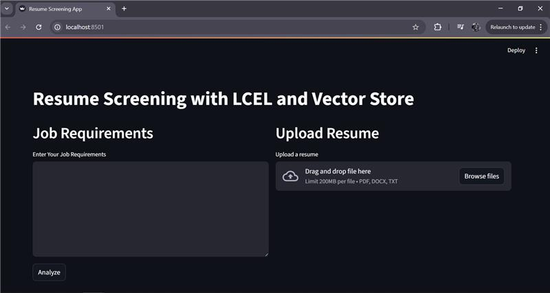

# Resume Screening Application with LangChain

## Overview
This is a Resume Screening Application developed using LangChain that assists HR professionals in efficiently screening candidate resumes against job requirements.The application pulls text from uploaded resumes, analyzes them based on an AI model, and gives a detailed compatibility report with match scores, skills assessment, and suggestions.

## Scenario
A company is looking for a Senior Python Developer post and receives hundreds of résumé applications. The HR team needs to rapidly filter these resumes to discover candidates whose abilities, experience, and qualifications best match the job criteria. Manually examining each CV is time-consuming and prone to human bias, leading to potential oversight of eligible individuals. The team requires an automated system to analyze applications against the job description, provide a complete compatibility assessment, and select the best prospects for further examination.

## Problem Statement
Create a resume Screening Application using LangChain that lets HR managers enter job requirements, submit a candidate's résumé (in PDF, DOCX, or TXT format), and examine the resume to find fit for the post. The application should extract text from the resume, compare it against the job requirements using an artificial intelligence model, and offer a structured analysis including a match score, skills assessment, experience relevance, education evaluation, strengths, weaknesses, and general candidate recommendation. The answer has to be easy to use, handle several file types, and let users download the analysis report for keeping records.

## Approach:-
Building a Resume Screening Application using LangChain and Streamlit, where users can:
- Input job requirements in a text area.
- Upload a resume in PDF, DOCX, or TXT format.
- Analyze the resume using Google’s Gemini 2.0 Flash model to get a detailed compatibility report.
- Download the analysis as a TXT file for record-keeping.

The application uses LangChain document loaders (PyPDFLoader, Docx2txtLoader, TextLoader) to extract text from resumes, and LangChain’s LLMChain with a custom prompt to generate a structured analysis. Streamlit provides a user-friendly interface with custom styling for better readability.

## Project Structure
- app.py: Main application code for the Resume Screening Application.
- requirements.txt: List of dependencies required to run the application.
- .env: Environment file to store the Google API key (GOOGLE_API_KEY).
- venv/: Virtual environment directory (e.g., env for storing installed packages).

## Setup Instructions:-
Create a Virtual Environment:
- Navigate to the project directory.
- Run: python -m venv venv (or env if preferred).
- Activate the virtual environment:
- Windows: venv\Scripts\activate
- macOS/Linux: source venv/bin/activate

## Install Dependencies:
- Ensure requirements.txt is in the project directory.
- Run: pip install -r requirements.txt

## Set Up the API Key:
- Create a .env file in the project directory.
- Add your Google API key: GOOGLE_API_KEY=your_api_key_here
- Ensure the .env file is loaded using python-dotenv (already included in app.py).

## Run the Application Locally:
- Run: streamlit run app.py
- Open the provided URL (e.g., http://localhost:8501) in your browser to access the app.


## Deploying on Streamlit Cloud:-

## Prepare Your Project:
- Ensure app.py, requirements.txt, and .env are in the project directory.
- Create a Streamlit Cloud account at https://streamlit.io/cloud.

## Upload to Streamlit Cloud:
- Log in to Streamlit Cloud.
- Create a new app and connect it to your project directory (e.g., upload the files manually or link to a cloud storage service).
- Specify app.py as the main script.

## Configure Environment Variables:
- In Streamlit Cloud, go to your app’s settings.
- Add the GOOGLE_API_KEY as a secret environment variable (do not include .env in the uploaded files for security).

## Deploy the App:
- vClick “Deploy” in Streamlit Cloud.
- Once deployed, access the app via the provided URL (e.g., https://your-app-name.streamlit.app).

## Test the Deployed App:
- Input job requirements, upload a resume, and analyze it.
- Verify that the analysis report is generated and downloadable.

## Requirements
The requirements.txt file includes all necessary dependencies.

## Usage
- Run the app locally or access the deployed version on Streamlit Cloud.
- Enter job requirements in the text area (e.g., skills, experience, qualifications).
- Upload a resume in PDF, DOCX, or TXT format.
- Click “Analyze Resume” to generate the AI-driven analysis.
- Review the structured report, including match score, skills assessment, and recommendation.
- Download the analysis as a TXT file for records.
### 🚀 Features

- Upload resumes in PDF, DOCX, or TXT formats
- Extract and analyze resume content using Google Gemini model
- Score resume suitability in percentage
- Store analysis results in a Chroma vector store
- View structured AI-generated feedback
- Download analysis as a text report

---

### 📦 Tech Stack

- **LangChain** for building chains, embeddings, and document processing
- **LangChain Expression Language (LCEL)** for modular pipeline workflows
- **Streamlit** for the frontend web interface
- **Google Generative AI** (Gemini & Embeddings) for LLM and vector representations
- **Chroma** as a persistent vector store
- **dotenv** for API key and environment config

---

### 🛠️ Setup Instructions
````

1. **Create and activate a virtual environment**

   ```bash
   python -m venv venv
   source venv/bin/activate   # or venv\Scripts\activate on Windows
   ```

2. **Install dependencies**

   ```bash
   pip install -r requirements.txt
   ```

3. **Add your API key**
   Create a `.env` file in the project root and add:

   ```
   GOOGLE_API_KEY=your_google_api_key
   ```

4. **Run the app**

   ```bash
   streamlit run app.py
   ```

````

---

### 📄 File Structure

```plaintext
├── app.py                  # Main Streamlit app
├── chroma_store/           # Folder to store vector DB files
├── .env                    # Contains API key (not committed)
├── requirements.txt        # Python dependencies
└── README.md               # This file
```

---

### 📚 LangChain Concepts Used

* ✅ **Components & Modules**: PromptTemplate, LLM, Output Parsers
* 📄 **Document Loaders**: PDF, DOCX, TXT via LangChain community
* ✂️ **Text Splitting**: RecursiveCharacterTextSplitter
* 🧠 **Embeddings**: GoogleGenerativeAIEmbeddings
* 🗃️ **Vector DB**: Chroma for persistent storage
* 🧩 **LCEL**: RunnableMap, pipes (`|`), and chain composition
* 🧪 **Chains**: Custom chain for job/resume comparison
* 📤 **Deployment**: Streamlit as the UI layer

---

### 📈 Example Output

```
Structured Analysis:
- Strengths: Relevant experience, strong communication, etc.
- Weaknesses: Lacks X, missing Y...

Suitability Score: 84%
```

---

### 🧑‍💼 Ideal For

* HR professionals and recruiters
* Resume screening automation tools
* Educational and project demos for LangChain and LCEL